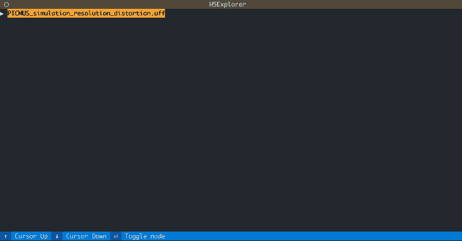

# H5 file explorer app
This is a simple demo of how easy it is to build TUI (text user interface) with [the Textual library](https://github.com/Textualize/textual). It lets you open a `.h5` file ([Hierarchical Data Format](https://en.wikipedia.org/wiki/Hierarchical_Data_Format)) and explore it in a tree-view.



## Try it out yourself!
To test it out you can grab [an example file]((http://www.ustb.no/datasets/PICMUS_simulation_resolution_distortion.uff)) from [the open USTB datasets](http://www.ustb.no/ustb-datasets/). Those files end in `.uff` (ultrasound file format), but they're really `.h5` files in disguise 😉

The demo requires two dependencies: `h5py` and `textual`. You can install them in a virtual environment as explained below. You may also install them globally if you'd like, like a crazy person.

```bash
git clone https://github.com/magnusdk/h5_explorer.git
cd h5_explorer
python3 -m venv .venv
source .venv/bin/activate
pip install -r requirements.txt
# Note: you must download this file first
# http://www.ustb.no/datasets/PICMUS_simulation_resolution_distortion.uff
python main.py PICMUS_simulation_resolution_distortion.uff
```